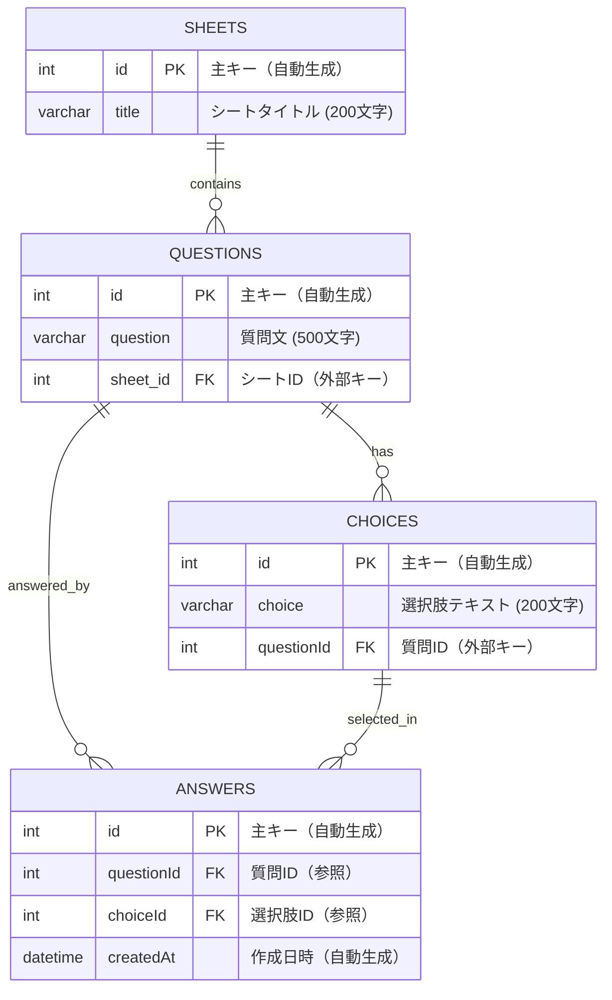

# atocos-survey-app

## 使用技術

- Frontend
  - Next.js
  - TypeScript
  - SCSS
- Backend
  - NestJS
  - TypeORM
- API
  - GraphQL
  - Apollo
- DB
  - MySQL

## API仕様
### sheets（全シート取得）
| Input | 型 | 必須 | 説明 |
| --- | --- | --- | --- |
| - | - | - | - |

| Output | 型 | 説明 |
| --- | --- | --- |
| sheets | [Sheet!]! | 全シートの配列 |

### questions（全質問取得）
| Input | 型 | 必須 | 説明 |
| --- | --- | --- | --- |
| - | - | - | - |

| Output | 型 | 説明 |
| --- | --- | --- |
| questions | [Question!]! | 全質問の配列 |

### questionsBySheet（シート別質問取得）
| Input | 型 | 必須 | 説明 |
| --- | --- | --- | --- |
| sheetId | Int! | ✓ | シートID |

| Output | 型 | 説明 |
| --- | --- | --- |
| questionsBySheet | [Question!]! | 指定シートの質問配列 |

### question（単一質問取得）
| Input | 型 | 必須 | 説明 |
| --- | --- | --- | --- |
| id | Int! | ✓   | 質問ID |

| Output | 型 | 説明 |
| --- | --- | --- |
| question | Question | 指定された質問（nullable）|

### answers（全回答取得）
| Input | 型 | 必須 | 説明 |
| --- | --- | --- | --- |
| - | - | - | - |

| Output | 型 | 説明 |
| --- | --- | --- |
| answers | [Answer!]! | 全回答の配列 |

### createSheet（シート作成）
| Input | 型 | 必須 | 説明 |
| --- | --- | --- | --- |
| title | String! | ✓   | シートタイトル |

| Output | 型 | 説明 |
| --- | --- | --- |
| createSheet | Sheet! | 作成されたシート |

### createQuestion（質問作成）
| Input | 型 | 必須 | 説明 |
| --- | --- | --- | --- |
| question | String!    | ✓   | 質問文     |
| choices  | [String!]! | ✓   | 選択肢の配列  |
| sheetId  | Int        | -   | 所属シートID |

| Output | 型 | 説明 |
| --- | --- | --- |
| createQuestion | Question! | 作成された質問 |

### deleteQuestion（質問削除）
| Input | 型 | 必須 | 説明 |
| --- | --- | --- | --- |
| id    | Int! | ✓   | 削除する質問ID |

| Output | 型 | 説明 |
| --- | --- | --- |
| deleteQuestion | Boolean! | 削除成功フラグ |

### submitAnswers（回答送信）
| Input | 型 | 必須 | 説明 |
| --- | --- | --- | --- |
| answers | [AnswerInput!]! | ✓   | 回答データの配列 |

| Output | 型 | 説明 |
| --- | --- | --- |
| submitAnswers | SubmitAnswersResponse! | 送信結果 |

## ER図

